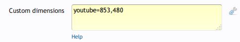

How to change the dimension of a media site
===========================================
You can specify custom dimensions for any number of media sites. For each media site you want to customise, add a line with the media site ID followed by an equal sign and the custom dimensions (width, height) separated with a comma. For example, if you want YouTube to be displayed in a 853 × 480 player and Dailymotion in a 640 × 360 player, you will enter:

```
youtube=853,480
dailymotion=640,360
```



Click "Save Changes" and you're done.